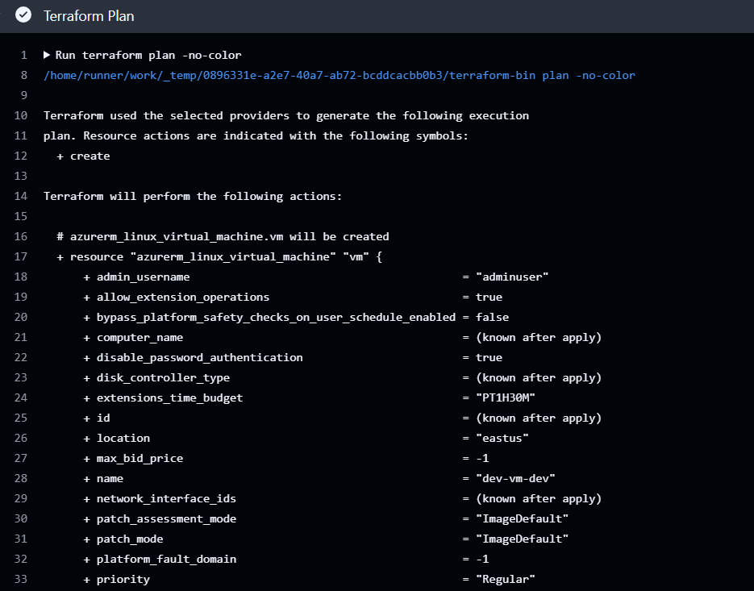
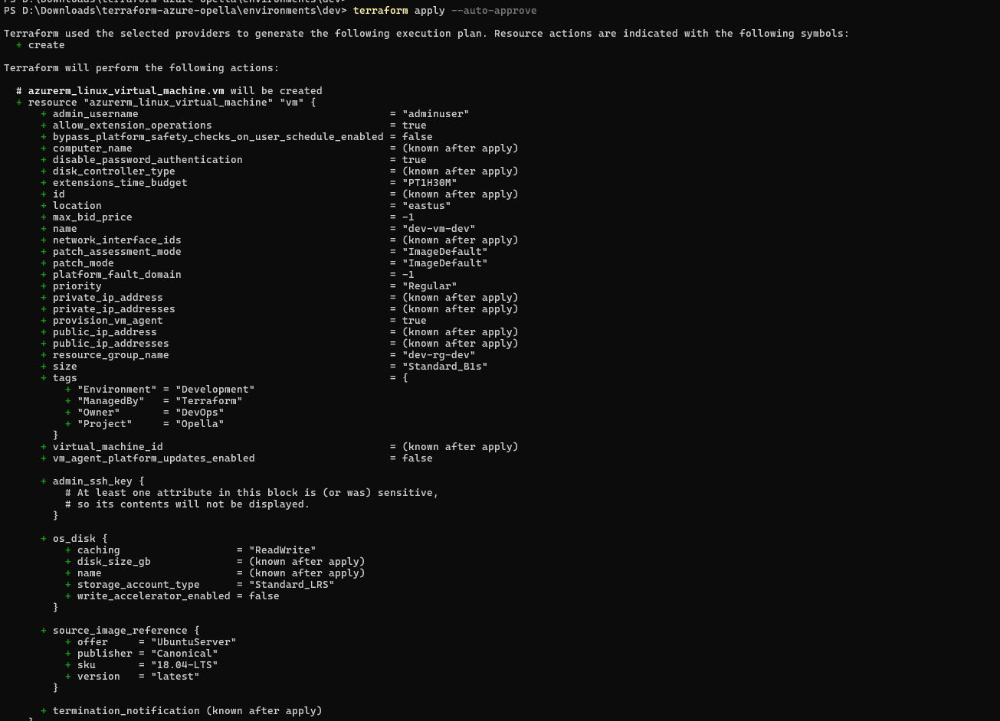
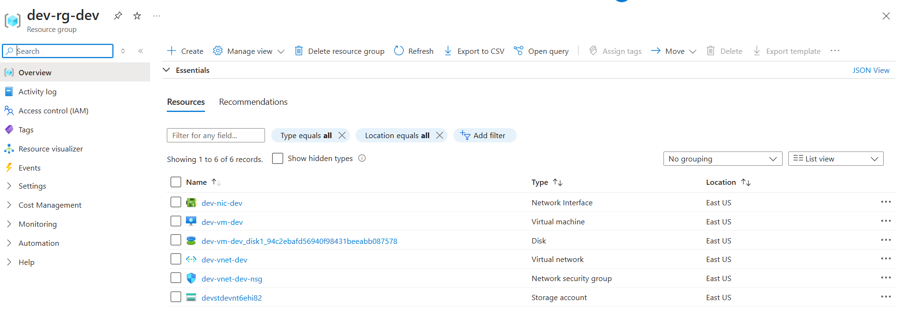

# terraform-azure-opella
# 🚀 Opella DevOps Challenge – Terraform Azure Infrastructure

This project demonstrates provisioning Azure infrastructure using **Terraform**, with reusable modules, multi-environment support, and GitHub Actions CI/CD.

---

## 🎯 Objective

- ✅ Build a **reusable VNET module**
- ✅ Deploy **Dev environment** in Azure
- ✅ Add **Virtual Machine** and **Blob Storage**
- ✅ Automate everything using **GitHub Actions**

---

## 📁 Project Structure

├── .github/workflows/ # GitHub Actions pipeline │ └── terraform.yml ├── environments/ │ └── dev/ # Dev environment configs ├── modules/ │ └── vnet/ # Reusable VNET module ├── images/screenshots/ # Screenshot folder └── README.md


---

## 🧱 Reusable Terraform Module

Located at `modules/vnet`, the module provisions:

- Virtual Network
- Subnets
- Network Security Groups (NSG)
- Output: VNET ID, subnet IDs, NSG names

**Why reusable?**
- Accepts CIDR blocks, subnet count, names, tags, etc.
- Promotes DRY and modular code practices

---

## 🌍 Dev Environment Resources

Deployed under `environments/dev`:

- ✅ Resource Group
- 🖧 Virtual Network (via module)
- 🖥️ Ubuntu Virtual Machine
- 💾 Storage Account + Blob Container

Named using `env-region-resource` format with meaningful tags.

---

## ⚙️ GitHub Actions CI/CD

CI/CD is handled via `.github/workflows/terraform.yml`, performing:

- `terraform init`, `fmt`, `validate`, `plan`, `apply`
- Triggered on push to `main`
- Auth via GitHub secrets (`ARM_CLIENT_ID`, etc.)

---

## 📸 Screenshots

| Description                        | Image                                                                 |
|------------------------------------|------------------------------------------------------------------------|
| ✅ Azure Tenant Subscription        |                    |
| 📄 Terraform Plan Output           |   |
| 🚀 Terraform Apply Output          | |
| 🌐 Azure Resources in Portal       | |

---

## 💡 Best Practices & Tools

- 🔄 **Reusable modules** for VNET
- 🧹 **terraform fmt**, **tflint** for clean code
- 💬 **Descriptive tags** and naming conventions
- 🔐 **Secrets** managed securely in GitHub
- 📦 **Environment separation** with folder structure

---

## 📂 Sample Terraform Commands

```bash
cd environments/dev

# Init and validate
terraform init
terraform fmt
terraform validate

# Plan
terraform plan -var-file="dev.tfvars"

# Apply
terraform apply -var-file="dev.tfvars"
